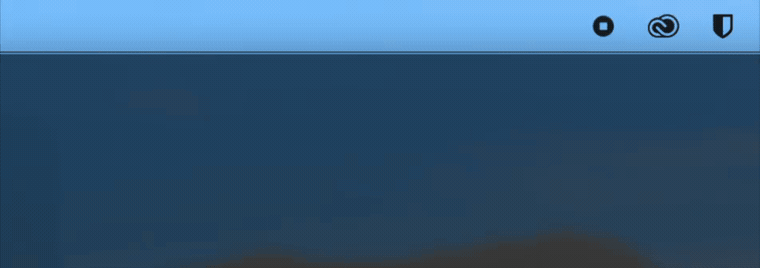

# Miri

<p align="center">
  <strong>Speak to your coding agents. Keep control of the destination.</strong>
</p>

<p align="center">
  <a href="https://github.com/adityakanu/miri/actions/workflows/ci.yml"></a>
  <a href="https://github.com/adityakanu/miri/releases"></a>
  <a href="LICENSE"></a>
  <a href="https://github.com/adityakanu/miri/stargazers"></a>
  
  
</p>

<p align="center">
  
</p>

Miri is a local-first macOS voice bridge for coding agents. Hold a shortcut,
speak a prompt, and Miri routes the local transcript to the exact agent session
you selected. Agents can send short spoken progress, blocker, approval, and
completion updates back through Miri.

<p align="center">
  <a href="https://github.com/FluidInference/FluidAudio">
    
  </a>
</p>

> [!CAUTION]
> Miri currently uses a free ad-hoc signature and requires a
> one-time macOS **Open Anyway** action. Use them only when downloaded from
> this repository’s GitHub Releases and verify the published checksum.

## Get Miri

### DMG — easiest install

Download `Miri-<version>.dmg` from
[GitHub Releases](https://github.com/adityakanu/miri/releases), then:

1. Open the DMG and drag **Miri.app** to Applications.
2. Open Miri once. macOS will block the unnotarized app.
3. Open **System Settings → Privacy & Security** and choose **Open Anyway**.
4. Launch Miri again, grant microphone access, and choose your shortcut.

The DMG drag-and-drop experience works without a paid Apple developer account;
the Gatekeeper confirmation is the trade-off. A checksum file accompanies every
release:

```sh
shasum -a 256 -c Miri-<version>.sha256
```

### Build from source

For contributors and developers:

```sh
git clone https://github.com/adityakanu/miri.git
cd miri
make bootstrap
swift run miri-app
```

Requires Apple Silicon, macOS 14+, Xcode, and Homebrew. `swift run miri-app`
runs the development app; `miri` is the CLI. Speech models download after one
explicit consent prompt on first use. There is no Python runtime and no worker
subprocess anywhere in the product.

## How it works

| Speak | Route | Hear |
| --- | --- | --- |
| Hold your global shortcut and speak. | Miri snapshots the active, default, or dedicated-hotkey target. | Get concise, filtered spoken agent updates. |
| Release to transcribe locally. | Never guesses from the frontmost terminal. | Interrupt speech by starting a new recording. |

- **Local speech:** NVIDIA Parakeet TDT v3 transcription and PocketTTS speech
  synthesis run through FluidAudio/CoreML inside Miri's own process. The
  Parakeet encoder runs on the Apple Neural Engine; PocketTTS runs at
  FluidAudio's default GPU-backed placement.
- **Push to talk only:** Miri listens only while you hold the shortcut. Wake
  word is not available in 0.1.4.
- **Explicit agents:** Codex is the validated adapter; Claude Code and Hermes
  are experimental. Generic local commands and a safe Clipboard fallback are
  also available.
- **No focus stealing:** a compact notch-adjacent status pill stays out of your
  editor and terminal.
- **Recoverable delivery:** one-item target queues plus a memory-only outbox
  for retry, edit, copy, or discard.

## First use

1. Launch Miri from the menu bar.
2. Grant microphone permission when asked.
3. Select **Clipboard** for a safe first test, or add an exact Codex thread in
   **Settings → Targets**.
4. In **Settings → Targets**, choose **Install or Repair Miri MCP**. Restart
   Codex after registration.
5. Hold `Option + Space`, speak, and release.
6. Watch the pill: listening → transcribing → sending → delivered.

When an agent asks a question, the next global-hotkey recording is pinned to
that same target and thread. For a Codex permission prompt, say exactly
`approve request` or `deny request`; vague phrases such as “yes” never approve.

Press `Escape` to cancel. Miri is half-duplex: starting a new recording stops
speech playback so it does not transcribe itself.

### Tell Miri to speak

Agents can request short status speech through the private local socket:

```sh
miri status "Which option should I use?" --kind question --priority 1
```

Or use `miri-mcp` and its `voice_status` MCP tool. Miri applies length limits,
deduplication, rate limits, priority handling, and filters for obvious secrets,
logs, code, URLs, and private paths.

## Configure targets and speech

Configuration lives at `~/.config/miri/config.toml` and live-reloads after
valid edits. Start with [config.example.toml](config.example.toml).

```toml
version = 1
default_target = "clipboard"
input_mode = "push_to_talk"

[hotkeys]
active_target = "option+space"

[[targets]]
id = "clipboard"
name = "Clipboard"
adapter = "clipboard"
```

| Target | What Miri needs |
| --- | --- |
| Clipboard | Nothing else — copies the transcript safely. |
| Cursor (dictation) | macOS Accessibility permission. |
| Codex (validated) | Working directory and exact thread ID. |
| Claude Code (experimental) | Working directory and optional session ID. |
| Hermes (experimental) | Local API-server URL and exact session ID. |
| Generic command | Local executable path; transcript goes to stdin. |

### Dictate into whatever app you're using

The `cursor` target types your transcript wherever the caret already is — an
editor, a browser field, a terminal. Add it with **Settings → Targets → Add
Dictation Target**, or by hand:

```toml
[[targets]]
id = "cursor"
name = "Cursor"
adapter = "cursor"
```

macOS requires Accessibility permission before one app may type into another;
Miri prompts on first use and refuses to send until it is granted, rather than
dropping the text silently. Delivery uses synthesized key events, so your
clipboard is never read or overwritten.

Transcripts are converted to written form before delivery, so "set the port to
eight thousand and eighty" arrives as "set the port to 8080".

FluidAudio downloads the Parakeet and PocketTTS CoreML weights only after one
explicit consent prompt covering about **1 GB** in total: roughly 470 MB for
Parakeet under `~/Library/Application Support/FluidAudio/Models`, and roughly
520 MB for the PocketTTS voice under `~/.cache/fluidaudio/Models`. Model weights
are not embedded in the DMG. The packaged arm64 application itself is about
**56 MB**, including the `miri` CLI and `miri-mcp` helper. **Settings → Speech →
Delete Models** removes both model roots.

## Privacy

Miri is local-first:

- No analytics and no local HTTP server.
- Audio stays on your Mac: Parakeet is the only transcription backend in 0.1.4.
- Push to talk only — Miri captures audio solely while you hold the shortcut.
- No persistent transcript history.
- Failed deliveries stay only in memory and disappear when Miri quits.
- Logs omit raw audio and full transcripts by default.

Read [privacy details](docs/privacy.md) before connecting third-party local
agent processes. Clipboard and generic-command targets disclose the transcript
to the process you explicitly choose.

## Project status

| Area | Status |
| --- | --- |
| Menu-bar app, hotkeys, overlay, routing, outbox | Implemented |
| In-process Parakeet STT and PocketTTS on CoreML | Implemented |
| Written-form transcripts (inverse text normalization) | Implemented |
| Dictation into the focused app | Implemented; needs live hardware validation |
| Codex exact-thread targeting, speech, questions, and approvals | Implemented and live-validated |
| Claude Code and Hermes adapters | Experimental — no live compatibility evidence yet |
| M4 benchmark evidence | Stale; must be recollected against the CoreML-only build |
| Signed/notarized DMG and official Homebrew Cask | Planned |
| Cloud transcription, wake word, model lifecycle profiles | Removed |

### Known limitations

- Ad-hoc signed, **not** Apple-notarized: a one-time **Open Anyway** is required.
- Apple Silicon only, macOS 14 or newer.
- English voice only; no custom vocabulary, multilingual catalog, spoken
  correction, mobile/remote relay, or worktree/diff dashboard.
- PocketTTS runs at FluidAudio's default GPU-backed placement, not the Neural
  Engine. Only the Parakeet encoder is ANE-resident.
- Dictation to the focused app needs macOS Accessibility permission.
- Published benchmark evidence is stale and incomplete.

`swift test` currently executes 130 tests: 127 pass, 3 are skipped because they
assert the model-not-installed path and the machine already has models
downloaded.

The formal gates are in [docs/release-checklist.md](docs/release-checklist.md).

## Documentation

- [Install and remove Miri](docs/installation.md)
- [Adapter setup](docs/adapters.md)
- [Architecture](docs/architecture.md)
- [IPC contract](docs/ipc.md)
- [Model and runtime licenses](docs/model-licenses.md)
- [Benchmark protocol](docs/benchmarks.md)
- [Competitive landscape](docs/competitive-landscape.md)

## Acknowledgments

Miri's local speech stack is powered by
[FluidAudio](https://github.com/FluidInference/FluidAudio), an Apache-2.0 Swift
framework from the FluidInference Team. Miri uses FluidAudio's CoreML model
management, Parakeet TDT v3 ASR, and PocketTTS streaming synthesis. This is the
foundation that lets Miri ship without Python and keep microphone audio
in-process and on-device.

Parakeet TDT v3 was created by NVIDIA and converted to CoreML by
FluidInference. PocketTTS was created by Kyutai and converted to CoreML by
FluidInference. Model downloads remain subject to their CC-BY-4.0 terms.

See [Third-party notices](THIRD-PARTY-NOTICES.md) and the
[model/runtime license inventory](docs/model-licenses.md) for complete source,
license, and attribution links.

## Contributing

Issues and pull requests are welcome. Keep changes local-first, preserve the
agent-neutral contracts, add tests, and run:

```sh
make test
```

Please never include secrets, raw audio, or private transcripts in GitHub
issues, pull requests, or logs.

## License

Licensed under the [Apache License 2.0](LICENSE).
